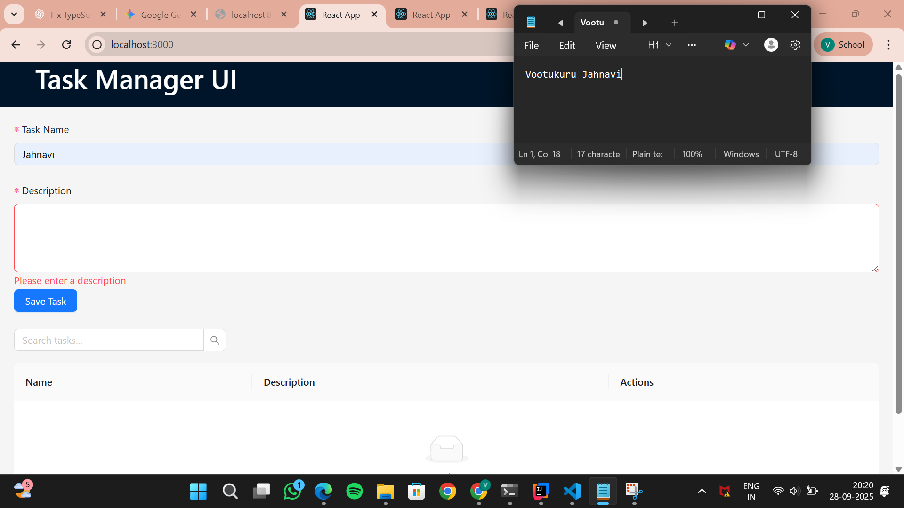

# Task Manager UI

A **React + TypeScript frontend** for managing tasks with features to create, list, execute, delete, and search tasks.  

This project uses **Ant Design** for UI components and communicates with a backend running at `http://localhost:8080`.

---

## **Features**

- Add a new task (name + description)
- List all tasks
- Execute tasks via a modal
- Delete tasks
- Search tasks
- File upload (optional)

---

## **Screenshots**

### Task Creation


### Task Execution


---

## **Setup Instructions**

### 1️⃣ Clone the repository

```bash
git clone https://github.com/vootukurujahnavi/task-manager-ui.git
cd task-manager-ui
